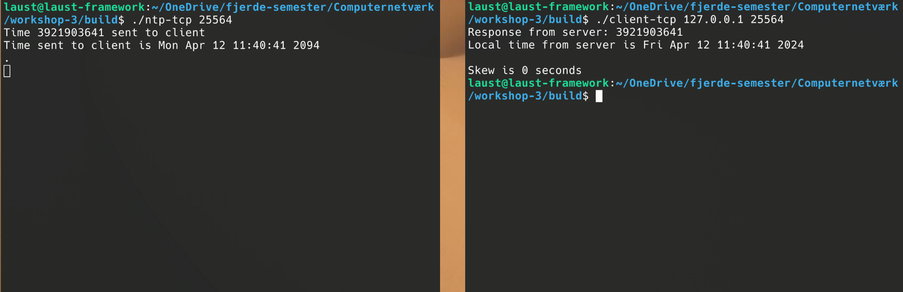

# Simple NTP TCP/UDP server/client

A simple NTP server and client for both UDP and TCP written in C.  
  
This project has been tested to work on Linux and MacOS but *not* Windows.

### Note:  
Please note that this program has not been thoroughly tested and given the wrong input it will seg fault!

## Installation

Clone the repository

```bash
  git clone https://github.com/PeterLaustAlmvig/workshop-3.git  
```

## Build the project

Go to the root of the project
```bash
    cd workshop-3/
```
Build the project by running
```bash
    mkdir build
    cd build
    cmake ..
    cmake --build .
```
This will build the project. All the executables will be found in the build folder.

```bash
    $ ls
    client-tcp  CMakeCache.txt  cmake_install.cmake  ntp-tcp  time_test
    client-udp  CMakeFiles      Makefile             ntp-udp
```

## Usage/Examples

The server and client is called the same way for TCP and UDP.  
The password argument is optional.

### Starting the server
```bash
    ./ntp-tcp <port> [password]
```
or
```bash
    ./ntp-udp <port> [password]
```
If you get an error like
```bash
    bind failed: Permission denied
```
Try setting the port outside the [well defined ports ](https://en.wikipedia.org/wiki/List_of_TCP_and_UDP_port_numbers).  
Try setting the port to 25564 or something similar.
### Starting the client
Please note that only IPv4 addresses are supported.
```bash
    ./client-tcp <ip> <port> [password]
```
or
```bash
    ./client-udp <ip> <port> [password]
```
If the server is running locally on your machine you can run the client like so
```bash
    ./client-tcp 127.0.0.1 <port> [password]
```

### Output
When running the server it will write out if the server has been password enabled.  
It will write out every time the time has been sent to a client.  
It will write out the time it sent (in seconds passed since Jan 1st 1900).
It will write out the timestamp converted to the local time zone.  
  
When running the client it will write out if a password was passed.  
It will write out the response from the server (in seconds passed since Jan 1st 1900).  
It will write out the timestamp converted to the local time zone.  
It will write out the skew in seconds.


## Screenshots


